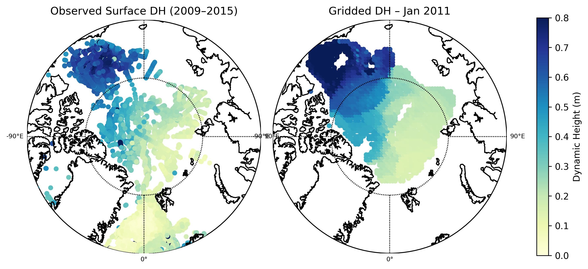
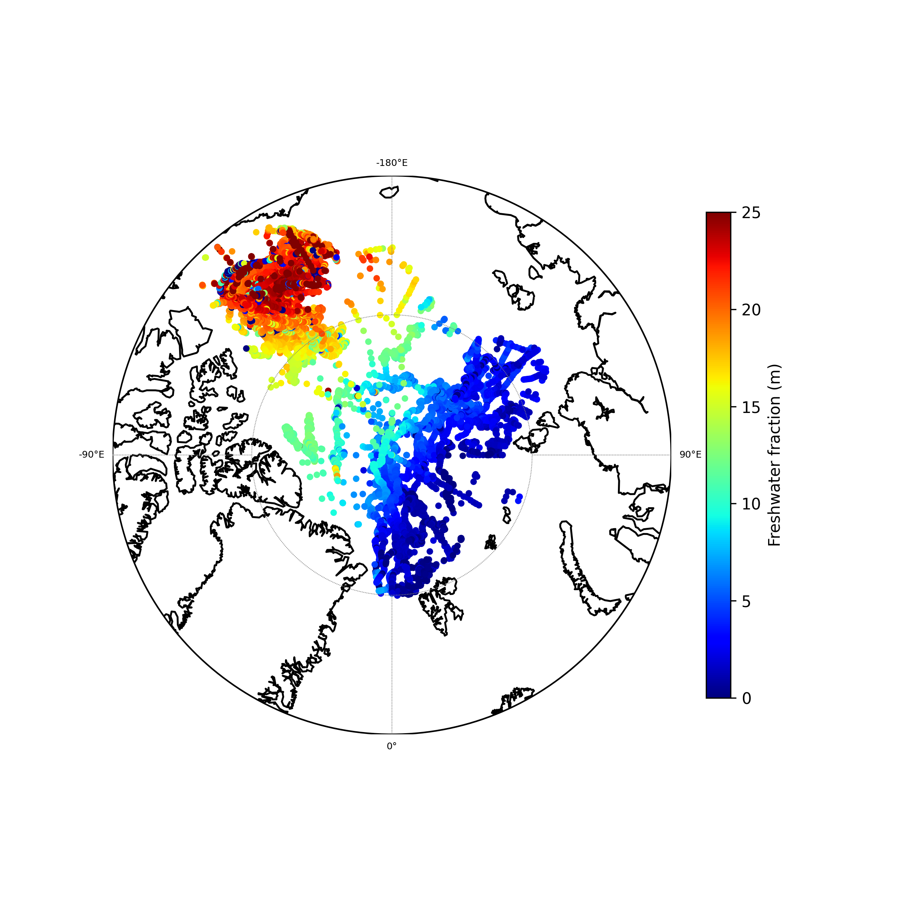
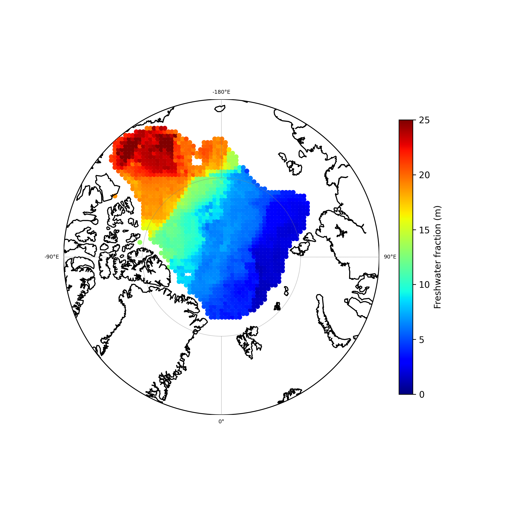

# pyoceanmap

[](https://github.com/simransuresh/pyoceanmap/actions/workflows/tests.yml)
[](https://pyoceanmap.readthedocs.io)
[](LICENSE)
[](https://doi.org/10.5281/zenodo.XXXXXXX)

A Python package that maps irregular in-situ hydrographic observations onto a regular grid
using physics-informed objective mapping — geodesic distance and potential-vorticity similarity,
constrained by bathymetry. Useful wherever ocean observations are sparse and irregularly
sampled.

## Installation

```bash
git clone https://github.com/simransuresh/pyoceanmap
cd pyoceanmap
pip install -e .
```

Requires Python 3.10+. Optional extras: `pip install -e ".[test]"` for the test suite,
`pip install -e ".[docs]"` for building the documentation locally.

## Quickstart

```python
from pyoceanmap import (
    merge_txt_to_csv,
    generate_arctic_grid,
    add_depth_to_grid,
    compute_dynamic_height,
    objective_map,
)

merge_txt_to_csv("./data/", "merged.csv")

compute_dynamic_height("merged.csv", "data_points.csv")

generate_arctic_grid("grid.csv", dx=50_000)
add_depth_to_grid("grid.csv", "grid.csv", nc_file="IBCAO_v4_2_13_400m.nc")

objective_map(
    data_csv="data_points.csv",
    grid_csv="grid.csv",
    output_csv="mapped.csv",
    target_time="2013-09-01",
    observable="Surf_DH",
)
```

See [`examples/workflow.py`](examples/workflow.py) and
[`examples/end2end_demo.ipynb`](examples/end2end_demo.ipynb) for a full runnable pipeline, and
the [documentation](https://pyoceanmap.readthedocs.io) for the complete API reference.

## Variables

- **Dynamic Height (DH)** — from TEOS-10 (via `gsw`)
- **Freshwater Content (FWC)** [1]

## Case study: Central Arctic Ocean

Mapping from UDASH [2] hydrographic observations to resolve large-scale circulation patterns —
the Beaufort Gyre and Transpolar Drift.

**Dynamic height** — sparse observations (left) objectively mapped onto a 50 km grid (right),
January 2011:

<p align="center">
  
</p>

**Freshwater content** — irregular UDASH observations, 2011–2018 (left) and the objectively
mapped field for January 2012 (right):

<p align="center">
  
  
</p>

The same objective mapping method has also been applied to the **Southern Ocean** — gridding
upper-ocean hydrographic properties in the Weddell Gyre from Argo float measurements [3].

## Citation

If you use `pyoceanmap` in your research, please cite it — see [`CITATION.cff`](CITATION.cff)
and the accompanying JOSS paper at [`paper/paper.md`](paper/paper.md).

## AI Usage Disclosure

The core scientific and numerical code in this package — hydrographic data preprocessing,
TEOS-10-based dynamic height and freshwater content calculations, grid generation, bathymetric
integration, and the physics-informed objective mapping algorithm (potential-vorticity- and
bathymetry-aware covariance modeling) — was designed and written entirely by the author without
AI assistance. AI assistance (Claude Code, Anthropic) was used for restructuring the prototype
into an installable package, configuring Sphinx documentation, and rephrasing the paper and this
README, all under the author's direction and review.

## License

BSD 3-Clause — see [LICENSE](LICENSE).

## References

[1] Rabe, B., Karcher, M., Schauer, U., Toole, J. M., Krishfield, R. A., Pisarev, S., Kauker, F.,
Gerdes, R., and Kikuchi, T.: An assessment of Arctic Ocean freshwater content changes from the
1990s to the 2006–2008 period, Deep-Sea Res. Pt. I, 58, 173–185,
https://doi.org/10.1016/j.dsr.2010.12.002, 2011.

[2] Behrendt, A., Sumata, H., Rabe, B., and Schauer, U.: UDASH – Unified Database for Arctic and
Subarctic Hydrography, Earth Syst. Sci. Data, 10, 1119–1138,
https://doi.org/10.5194/essd-10-1119-2018, 2018.

[3] Reeve, K. A., Boebel, O., Kanzow, T., Strass, V., Rohardt, G., and Fahrbach, E.: A gridded
data set of upper-ocean hydrographic properties in the Weddell Gyre obtained by objective
mapping of Argo float measurements, Earth Syst. Sci. Data, 8, 15–40,
https://doi.org/10.5194/essd-8-15-2016, 2016.
